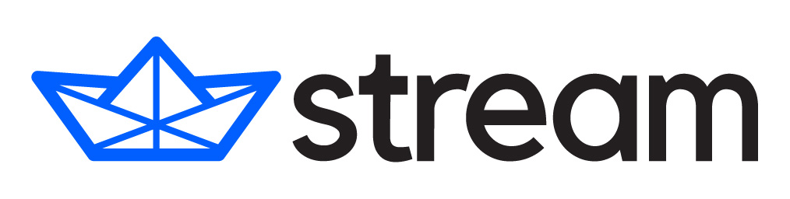

    

<h1 align="center">ChatHub</h1>

### Install

## 📷 Screenshot

## 🤝 Sponsors

## ✨ Features

- 🤖 Use different chatbots in one app, currently supporting ChatGPT, new Bing Chat, Google Bard, Claude, and open-source models including LLama2, Vicuna, ChatGLM etc
- 💬 Chat with multiple chatbots at the same time, making it easy to compare their answers
- 🚀 Support ChatGPT API and GPT-4 Browsing
- 🔍 Shortcut to quickly activate the app anywhere in the browser
- 🎨 Markdown and code highlight support
- 📚 Prompt Library for custom prompts and community prompts
- 💾 Conversation history saved locally
- 📥 Export and Import all your data
- 🔗 Share conversation to markdown
- 🌙 Dark mode
- 🌐 Web access

## 🤖 Supported Bots

- ChatGPT (via Webapp/API/Azure/Poe)
- Bing Chat
- Google Bard
- Claude 2 (via Webapp/API/Poe)
- LLaMA 2
- ChatGLM
- Pi by Inflection
- Vicuna
- WizardLM
- iFlytek Spark
- Tongyi Qianwen
- Baichuan
- Deepseek (via API/PPIO)
- ...

## 🔨 Build from Source

- Clone the source code
- `corepack enable`
- `yarn install`
- `yarn build`
- In Chrome/Edge go to the Extensions page (chrome://extensions or edge://extensions)
- Enable Developer Mode
- Drag the `dist` folder anywhere on the page to import it (do not delete the folder afterward)
