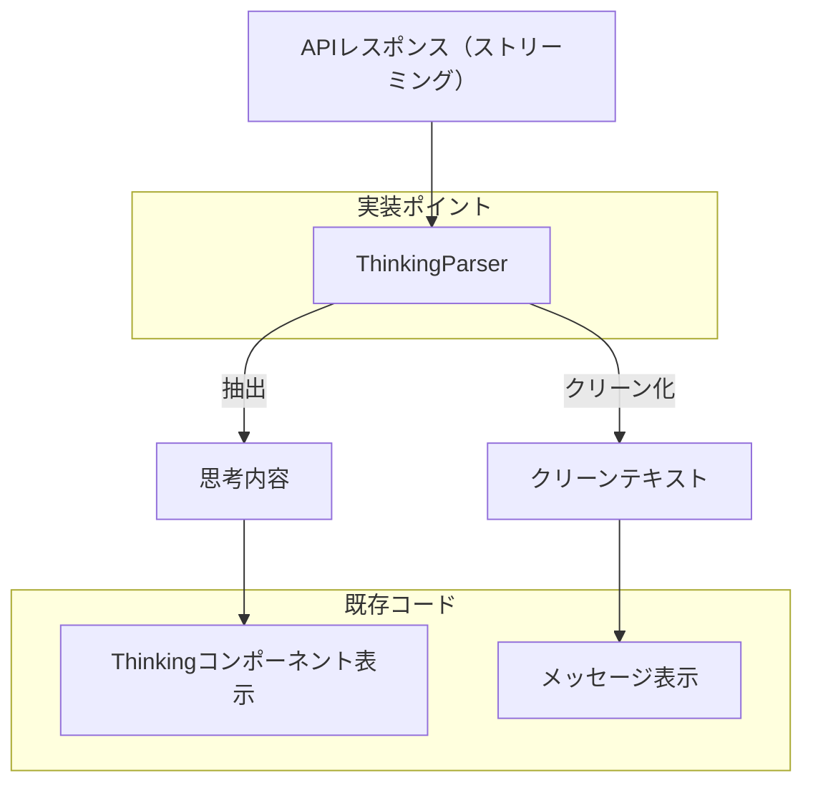
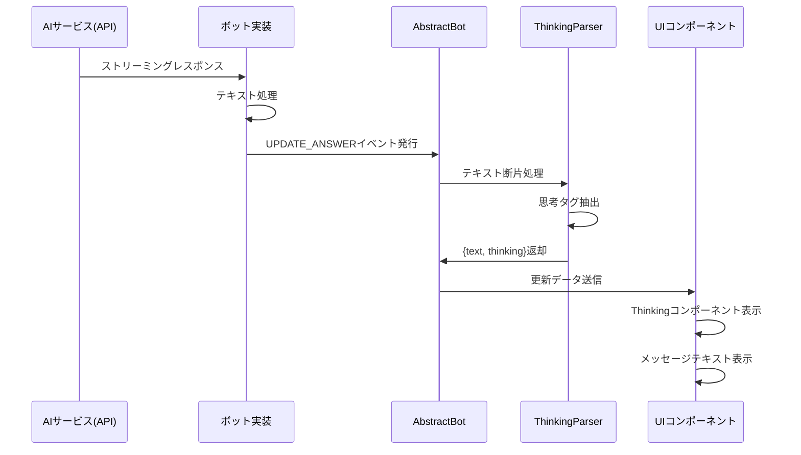

# ThinkingParserの最終実装計画

## 1. 概要と背景

現在、ChatHub (chathub) では、Bedrock APIモデルでのみ `thinking` モード（思考プロセスの表示）が実装されていますが、PerplexityなどのAIモデルも応答テキストの冒頭に `<thinking>...</thinking>` タグを含めることがあります。この実装計画では、テキスト内の思考タグを抽出して、すべてのモデルで共通して「思考モード」として表示できるように機能を拡張します。

## 2. 実装アーキテクチャ



## 3. データフロー



## 4. 主要コンポーネント

### ThinkingParser クラス

```typescript
/**
 * ストリーミングテキストから思考タグを抽出するパーサー
 */
export class ThinkingParser {
  // 状態変数
  private buffer: string = '';          
  private inThinkingBlock: boolean = false;  
  private extractedThinking: string = '';    
  private accumulatedText: string = '';      
  
  // タグパターン
  private readonly THINKING_START_PATTERNS = [/<thinking>/i, /<think>/i];
  private readonly THINKING_END_PATTERNS = [/<\/thinking>/i, /<\/think>/i];

  /**
   * テキスト断片を処理
   * @param textFragment 新しいテキスト断片
   * @returns 処理結果（クリーンテキストと抽出された思考内容）
   */
  processFragment(textFragment: string): { text: string; thinking?: string };
  
  /**
   * バッファを処理して思考内容を抽出
   */
  private _processBuffer(): void;
  
  /**
   * パーサーの状態をリセット
   */
  reset(): void;
}
```

### AbstractBot拡張

```typescript
export abstract class AbstractBot {
  // 既存プロパティ
  
  // 思考パーサーインスタンス
  private thinkingParser = new ThinkingParser();
  
  protected async *doSendMessageGenerator(params: MessageParams) {
    // パーサーリセット
    this.thinkingParser.reset();
    
    // ストリーム処理設定
    const stream = new ReadableStream<AnwserPayload>({
      start: (controller) => {
        this.doSendMessage({
          // 各種パラメータ
          onEvent: (event) => {
            if (event.type === 'UPDATE_ANSWER') {
              // テキスト処理と思考抽出
              const processedData = this._processThinkingContent(event.data);
              controller.enqueue(processedData);
            } else if (event.type === 'DONE') {
              // 終了処理
              this.thinkingParser.reset();
              controller.close();
            } else {
              // その他のイベント処理
            }
          },
        });
      },
    });
    
    yield* streamAsyncIterable(stream);
  }
  
  /**
   * テキストから思考内容を抽出する処理
   */
  private _processThinkingContent(data: AnwserPayload): AnwserPayload;
}
```

## 5. 技術的な考慮事項

### ストリーミング処理のエッジケース

1. **タグが複数チャンクにまたがるケース**
   ```
   チャンク1: "こんにちは。<thi"
   チャンク2: "nking>これは思考です"
   チャンク3: "</thinking>。回答を続けます"
   ```

2. **不完全なタグ構造**
   ```
   "ここから<thinking>思考が始まりますが終了タグがありません"
   ```

3. **入れ子のタグ**
   ```
   "<thinking>外側の思考<thinking>内側の思考</thinking>外側の続き</thinking>"
   ```

### 既存実装との互換性

- Bedrockの`reasoningContent`タイプのデータは、従来通りthinkingフィールドに設定される
- テキスト内にthinkingタグがある場合は、既存のthinkingフィールドを優先
- 追加の変更なしで他のモデルでも機能するようにする

## 6. 実装手順

1. **フェーズ1: ユーティリティ開発**
   - `src/utils/thinking-parser.ts` ファイルの作成
   - `ThinkingParser` クラスの実装
   - ユニットテストの作成

2. **フェーズ2: AbstractBot統合**
   - `AbstractBot` クラスへの組み込み
   - `doSendMessageGenerator` メソッドの拡張
   - `_processThinkingContent` メソッドの実装

3. **フェーズ3: テスト・検証**
   - 基本機能テスト
   - エッジケーステスト（不完全タグ、タグ分割など）
   - 既存機能との互換性テスト

4. **フェーズ4: リファクタリング・最適化**
   - コードクリーンアップ
   - パフォーマンス最適化
   - エラーハンドリング強化

## 7. テスト計画

1. **単体テスト**
   - さまざまなタグパターンでの`ThinkingParser`のテスト
   - 異なるタグ形式（`<thinking>`, `<think>`）のテスト
   - エッジケース検証

2. **統合テスト**
   - ストリーミング環境での正確な思考抽出の検証
   - 複数ボット実装での動作確認

3. **ユーザビリティテスト**
   - UIでの正しい表示
   - ユーザーエクスペリエンスの確認

## 8. 今後の拡張可能性

1. **より洗練されたタグ処理**
   - マークダウン内のコードブロックなど、特殊ケースの考慮
   - 複数の思考ブロックのサポート

2. **思考モードのカスタマイズ**
   - ユーザー設定による思考表示のON/OFF
   - 異なる思考タグのサポート拡張

## 9. まとめ

この実装により、ChatHubはすべてのAIモデルで思考プロセス表示を統一的にサポートします。これにより、ユーザーはPerplexityなどのモデルからも思考プロセスを確認できるようになり、AIの回答をより透明性を持って理解できるようになります。さらに、このアプローチは既存のBedrockの実装と互換性を保ちながら、新たな機能を提供します。